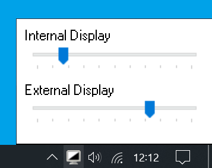

# Brightly

*Utility to adjust external monitor and internal screen brightness.*

Windows includes built-in adjustment for internal screens (e.g. laptops), but not typically for external monitors.

This program places an icon in the Windows taskbar notification area (system tray) to adjust display brightness, both for external monitors (via DDC/CI) and internal screens (via WMI).

## Download

Download from:

  * [Releases](https://github.com/danielgjackson/brightly/releases/latest)

...you can choose the `.msi` installer, or directly download and run the `.exe` file.

The source code is available at:

  * [github.com/danielgjackson/brightly](https://github.com/danielgjackson/brightly)

...and released under an open source [MIT License](https://github.com/danielgjackson/brightly/blob/master/LICENSE.txt).

## Usage

When you run *Brightly* (it can be configured to auto-run), an icon for *Brightly* will appear in the taskbar notification area. Left-click the icon to show sliders for brightness for connected displays (screens that do not support brightness adjustment over DDC/CI or WMI will be greyed out).  

Right-click the icon for a menu:

* *Open* - Opens the brightness adjustment display (same as left-clicking the icon).
* *Refresh* - The program should automatically find new monitors but, if it does not, use this to forcefully scan again.
* *Save Debug Info* - This will prompt to save a text (`.txt`) file with debugging information about the displays and brightness adjustments.
* *Auto-Start* - Toggles whether the executable will be automatically run when you log in.
* *About* - Information about the program.
* *Exit* - Stops the program and removes the icon. (If *Auto-Start* is enabled, it will start when you log-in again)

---

  * [danielgjackson.github.io/brightly](https://danielgjackson.github.io/brightly)
